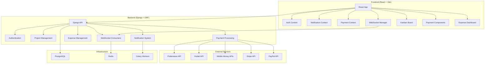
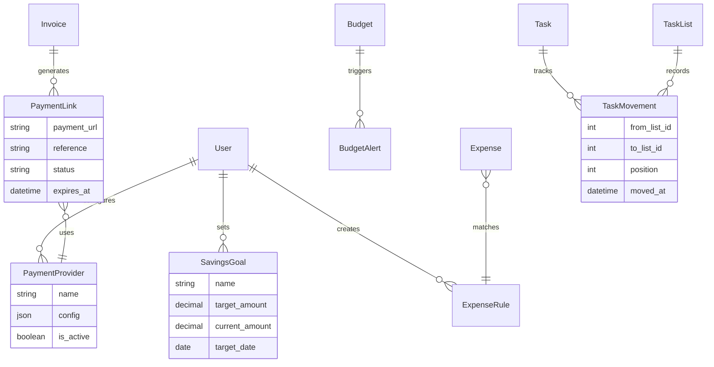

# Design Document

## Overview

This design document outlines the architecture for enhancing the existing freelancer client management app with improved Kanban project management, integrated payment processing for Ghanaian and international markets, advanced expense management, and real-time notifications. The design builds upon the existing Django REST Framework backend and React frontend, maintaining consistency with current patterns while adding new capabilities.

## Architecture

### System Architecture Diagram



## Components and Interfaces

### 1. Enhanced Kanban Project Management

#### Backend Components

**Model Extensions (projects/models.py):**
```python
# Extend existing TaskList model
class TaskList(models.Model):
    # ... existing fields ...
    list_type = models.CharField(max_length=20, choices=[
        ('backlog', 'Backlog'),
        ('todo', 'To Do'),
        ('in_progress', 'In Progress'),
        ('review', 'Review'),
        ('done', 'Done'),
        ('custom', 'Custom'),
    ], default='custom')
    
    class Meta:
        ordering = ['position']

# Extend existing Task model
class Task(models.Model):
    # ... existing fields ...
    priority = models.CharField(max_length=10, choices=[
        ('low', 'Low'),
        ('medium', 'Medium'),
        ('high', 'High'),
        ('urgent', 'Urgent'),
    ], default='medium')
    estimated_hours = models.DecimalField(max_digits=5, decimal_places=2, null=True, blank=True)
    
    class Meta:
        ordering = ['position']
```

**New API Endpoints:**
```python
# Enhanced project management endpoints
POST /api/tasks/{id}/move/                 # Move task between lists with position
GET /api/projects/{id}/board/              # Get optimized board data with prefetched relations
POST /api/projects/{id}/board/bulk-update/ # Bulk update task positions (for performance)

# Analytics endpoints
GET /api/projects/{id}/analytics/          # Project progress, time spent, completion rates
GET /api/tasks/overdue/                    # Get overdue tasks across all projects
```

**Note on Task Reordering:** 
Task reordering within lists is essential for prioritization and workflow management. Users need to be able to:
- Prioritize tasks within a column (most important at top)
- Organize tasks by deadline or complexity
- Group related tasks together
- Maintain visual organization that matches their workflow

This is implemented through the existing `position` field with drag-and-drop functionality.

**WebSocket Events:**
```python
# Real-time board updates
{
    "type": "task_moved",
    "task_id": 123,
    "from_list": 1,
    "to_list": 2,
    "position": 3,
    "user": "user@example.com"
}
```

#### Frontend Components

**Enhanced Kanban Board:**
```jsx
// New components to add
<KanbanBoard />
├── <BoardHeader />
├── <TaskListColumn />
│   ├── <TaskCard />
│   ├── <TaskTimer />
│   └── <TaskProgress />
├── <TaskModal />
├── <BulkActions />
└── <BoardAnalytics />
```

**Real-time Updates:**
- WebSocket integration for live board updates
- Optimistic UI updates with rollback on failure
- Conflict resolution for simultaneous edits

### 2. Integrated Payment Processing

#### Backend Components - New Django App: `payments`

**New Django App Structure:**
```
backend/payments/
├── __init__.py
├── models.py          # Payment-specific models
├── views.py           # Payment API endpoints
├── serializers.py     # Payment serializers
├── processors/        # Payment processor implementations
│   ├── __init__.py
│   ├── base.py        # Abstract base processor
│   ├── flutterwave.py # Flutterwave implementation
│   ├── hubtel.py      # Hubtel implementation
│   ├── momo.py        # Mobile Money implementation
│   ├── stripe.py      # Stripe implementation
│   └── paypal.py      # PayPal implementation
├── services.py        # Payment business logic
├── utils.py           # Payment utilities
├── webhooks.py        # Webhook handlers
├── admin.py           # Admin interface
├── urls.py            # Payment URLs
└── migrations/        # Database migrations
```

**Payment Models (payments/models.py):**
```python
from django.db import models
from django.conf import settings
from django.core.validators import MinValueValidator
from decimal import Decimal
import uuid

class PaymentProvider(models.Model):
    """Stores payment provider configurations per user"""
    PROVIDER_CHOICES = [
        ('flutterwave', 'Flutterwave'),
        ('hubtel', 'Hubtel'),
        ('mtn_momo', 'MTN Mobile Money'),
        ('vodafone_cash', 'Vodafone Cash'),
        ('stripe', 'Stripe'),
        ('paypal', 'PayPal'),
    ]
    
    user = models.ForeignKey(settings.AUTH_USER_MODEL, on_delete=models.CASCADE, related_name='payment_providers')
    provider_type = models.CharField(max_length=20, choices=PROVIDER_CHOICES)
    display_name = models.CharField(max_length=100)
    is_active = models.BooleanField(default=True)
    is_test_mode = models.BooleanField(default=True)
    
    # Encrypted configuration storage
    encrypted_config = models.TextField()  # Will store encrypted API keys/secrets
    
    created_at = models.DateTimeField(auto_now_add=True)
    updated_at = models.DateTimeField(auto_now=True)
    
    class Meta:
        unique_together = ['user', 'provider_type']
        indexes = [
            models.Index(fields=['user', 'is_active']),
        ]

class PaymentIntent(models.Model):
    """Represents a payment intent before actual payment processing"""
    STATUS_CHOICES = [
        ('pending', 'Pending'),
        ('processing', 'Processing'),
        ('completed', 'Completed'),
        ('failed', 'Failed'),
        ('cancelled', 'Cancelled'),
        ('expired', 'Expired'),
    ]
    
    id = models.UUIDField(primary_key=True, default=uuid.uuid4, editable=False)
    invoice = models.ForeignKey('invoices.Invoice', on_delete=models.CASCADE, related_name='payment_intents')
    provider = models.ForeignKey(PaymentProvider, on_delete=models.CASCADE)
    
    amount = models.DecimalField(max_digits=12, decimal_places=2, validators=[MinValueValidator(Decimal('0.01'))])
    currency = models.CharField(max_length=3, default='GHS')
    
    reference = models.CharField(max_length=100, unique=True)
    external_reference = models.CharField(max_length=100, blank=True)  # Provider's reference
    
    payment_url = models.URLField(blank=True)
    status = models.CharField(max_length=20, choices=STATUS_CHOICES, default='pending')
    
    metadata = models.JSONField(default=dict)  # Additional payment data
    
    created_at = models.DateTimeField(auto_now_add=True)
    updated_at = models.DateTimeField(auto_now=True)
    expires_at = models.DateTimeField()
    
    class Meta:
        indexes = [
            models.Index(fields=['reference']),
            models.Index(fields=['external_reference']),
            models.Index(fields=['status', 'created_at']),
        ]

class PaymentTransaction(models.Model):
    """Records actual payment transactions"""
    TRANSACTION_TYPES = [
        ('payment', 'Payment'),
        ('refund', 'Refund'),
        ('chargeback', 'Chargeback'),
    ]
    
    id = models.UUIDField(primary_key=True, default=uuid.uuid4, editable=False)
    payment_intent = models.ForeignKey(PaymentIntent, on_delete=models.CASCADE, related_name='transactions')
    
    transaction_type = models.CharField(max_length=20, choices=TRANSACTION_TYPES, default='payment')
    amount = models.DecimalField(max_digits=12, decimal_places=2)
    fee = models.DecimalField(max_digits=12, decimal_places=2, default=Decimal('0.00'))
    net_amount = models.DecimalField(max_digits=12, decimal_places=2)
    
    external_transaction_id = models.CharField(max_length=100)
    gateway_response = models.JSONField()  # Full gateway response
    
    processed_at = models.DateTimeField()
    created_at = models.DateTimeField(auto_now_add=True)
    
    class Meta:
        indexes = [
            models.Index(fields=['external_transaction_id']),
            models.Index(fields=['processed_at']),
        ]

class PaymentWebhook(models.Model):
    """Logs all webhook events for audit and debugging"""
    id = models.UUIDField(primary_key=True, default=uuid.uuid4, editable=False)
    provider_type = models.CharField(max_length=20)
    event_type = models.CharField(max_length=50)
    
    payload = models.JSONField()
    headers = models.JSONField()
    
    processed = models.BooleanField(default=False)
    processing_error = models.TextField(blank=True)
    
    created_at = models.DateTimeField(auto_now_add=True)
    processed_at = models.DateTimeField(null=True, blank=True)
    
    class Meta:
        indexes = [
            models.Index(fields=['provider_type', 'processed']),
            models.Index(fields=['created_at']),
        ]
```

**Payment Service Architecture:**
```python
# Abstract payment processor
class PaymentProcessor:
    def create_payment_link(self, invoice, amount, currency='GHS')
    def verify_payment(self, reference)
    def handle_webhook(self, payload)

# Concrete implementations
class FlutterwaveProcessor(PaymentProcessor)
class HubtelProcessor(PaymentProcessor)
class MomoProcessor(PaymentProcessor)
class StripeProcessor(PaymentProcessor)
class PayPalProcessor(PaymentProcessor)
```

**API Endpoints (payments/urls.py):**
```python
# Payment provider management
GET /api/payments/providers/               # List user's payment providers
POST /api/payments/providers/              # Configure new payment provider
PUT /api/payments/providers/{id}/          # Update payment provider
DELETE /api/payments/providers/{id}/       # Remove payment provider

# Payment processing
POST /api/payments/intents/                # Create payment intent
GET /api/payments/intents/{id}/            # Get payment intent details
POST /api/payments/intents/{id}/cancel/    # Cancel payment intent

# Webhook handling
POST /api/payments/webhooks/flutterwave/   # Flutterwave webhook endpoint
POST /api/payments/webhooks/hubtel/        # Hubtel webhook endpoint
POST /api/payments/webhooks/momo/          # Mobile Money webhook endpoint
POST /api/payments/webhooks/stripe/        # Stripe webhook endpoint

# Payment analytics
GET /api/payments/analytics/               # Payment analytics and reports
GET /api/payments/transactions/            # Transaction history
```

#### Frontend Components

**Payment Integration:**
```jsx
<PaymentSetup />          // Configure payment providers
<InvoicePaymentLinks />   // Display payment options on invoices
<PaymentStatus />         // Real-time payment status updates
<PaymentHistory />        // Transaction history and analytics
```

### 3. Advanced Expense Management

#### Backend Components

**Enhanced Models:**
```python
class ExpenseRule(models.Model):
    user = models.ForeignKey(User, on_delete=models.CASCADE)
    name = models.CharField(max_length=100)
    conditions = models.JSONField()  # Auto-categorization rules
    category = models.ForeignKey(ExpenseCategory, on_delete=models.CASCADE)

class SavingsGoal(models.Model):
    user = models.ForeignKey(User, on_delete=models.CASCADE)
    name = models.CharField(max_length=100)
    target_amount = models.DecimalField(max_digits=10, decimal_places=2)
    current_amount = models.DecimalField(max_digits=10, decimal_places=2, default=0)
    target_date = models.DateField()
    category = models.ForeignKey(ExpenseCategory, on_delete=models.CASCADE, null=True)

class BudgetAlert(models.Model):
    budget = models.ForeignKey(Budget, on_delete=models.CASCADE)
    alert_type = models.CharField(max_length=20)  # warning, exceeded, goal_reached
    threshold = models.DecimalField(max_digits=5, decimal_places=2)  # Percentage
    is_active = models.BooleanField(default=True)
```

**Analytics and Reporting:**
```python
GET /api/expenses/analytics/               # Spending analytics
GET /api/expenses/trends/                  # Spending trends over time
GET /api/budgets/performance/              # Budget performance metrics
POST /api/expenses/categorize/             # Auto-categorize expenses
GET /api/savings/projections/              # Savings projections
```

#### Frontend Components

**Enhanced Expense Dashboard:**
```jsx
<ExpenseDashboard />
├── <SpendingOverview />
├── <BudgetProgress />
├── <SavingsTracker />
├── <ExpenseCategories />
├── <TrendAnalytics />
└── <BudgetAlerts />
```

### 4. Real-time Notification System

#### Backend Components

**Enhanced WebSocket Consumer:**
```python
class NotificationConsumer(AsyncWebsocketConsumer):
    async def connect(self):
        # Enhanced connection handling with user groups
        
    async def notify_task_update(self, event):
        # Handle task movement notifications
        
    async def notify_payment_received(self, event):
        # Handle payment notifications
        
    async def notify_budget_alert(self, event):
        # Handle budget alerts
```

**Notification Types:**
```python
NOTIFICATION_TYPES = [
    ('task_moved', 'Task Moved'),
    ('task_overdue', 'Task Overdue'),
    ('payment_received', 'Payment Received'),
    ('payment_failed', 'Payment Failed'),
    ('budget_warning', 'Budget Warning'),
    ('budget_exceeded', 'Budget Exceeded'),
    ('invoice_overdue', 'Invoice Overdue'),
    ('project_deadline', 'Project Deadline'),
    ('savings_goal_reached', 'Savings Goal Reached'),
]
```

#### Frontend Components

**Real-time Notification System:**
```jsx
<NotificationProvider />
├── <WebSocketManager />
├── <NotificationToast />
├── <NotificationCenter />
├── <NotificationBadge />
└── <NotificationSettings />
```

## Data Models

### Enhanced Database Schema



## Error Handling

### Payment Processing Errors
```python
class PaymentError(Exception):
    def __init__(self, provider, error_code, message):
        self.provider = provider
        self.error_code = error_code
        self.message = message

# Error handling strategy
try:
    payment_link = processor.create_payment_link(invoice, amount)
except PaymentError as e:
    logger.error(f"Payment error: {e.provider} - {e.error_code}: {e.message}")
    # Fallback to alternative payment method
    # Notify user of the issue
```

### WebSocket Connection Handling
```javascript
class WebSocketManager {
    constructor() {
        this.reconnectAttempts = 0;
        this.maxReconnectAttempts = 5;
        this.reconnectInterval = 1000;
    }
    
    handleConnectionLoss() {
        if (this.reconnectAttempts < this.maxReconnectAttempts) {
            setTimeout(() => this.reconnect(), this.reconnectInterval);
            this.reconnectInterval *= 2; // Exponential backoff
        }
    }
}
```

### Data Synchronization
```javascript
// Optimistic updates with rollback
const moveTask = async (taskId, fromList, toList) => {
    // Optimistically update UI
    updateUIOptimistically(taskId, fromList, toList);
    
    try {
        await api.post(`/tasks/${taskId}/move/`, { to_list: toList });
    } catch (error) {
        // Rollback UI changes
        rollbackUIChanges(taskId, fromList, toList);
        showErrorMessage('Failed to move task');
    }
};
```

## Testing Strategy

### Backend Testing
```python
# Payment processor tests
class TestFlutterwaveProcessor(TestCase):
    def test_create_payment_link(self):
        # Test payment link creation
        
    def test_webhook_verification(self):
        # Test webhook signature verification
        
    def test_payment_status_update(self):
        # Test payment status updates

# WebSocket tests
class TestNotificationConsumer(ChannelsTestCase):
    async def test_task_movement_notification(self):
        # Test real-time task movement notifications
```

### Frontend Testing
```javascript
// Component tests
describe('KanbanBoard', () => {
    test('should move task between lists', async () => {
        // Test drag and drop functionality
    });
    
    test('should handle WebSocket disconnection', () => {
        // Test connection resilience
    });
});

// Integration tests
describe('Payment Integration', () => {
    test('should generate payment links', async () => {
        // Test payment link generation
    });
    
    test('should handle payment callbacks', () => {
        // Test payment status updates
    });
});
```

### Performance Testing
- Load testing for WebSocket connections (100+ concurrent users)
- Payment processing performance under high load
- Database query optimization for analytics endpoints
- Frontend rendering performance with large datasets

## Security Considerations

### Payment Security (Production-Grade)
```python
# Secure API key storage using django-cryptography
from django_cryptography.fields import encrypt

class PaymentProvider(models.Model):
    # Store encrypted API keys
    encrypted_config = encrypt(models.JSONField())
    
    def get_config(self):
        """Decrypt and return configuration"""
        return self.encrypted_config
    
    def set_config(self, config_data):
        """Encrypt and store configuration"""
        # Validate required fields before encryption
        self.encrypted_config = config_data

# Webhook signature verification
class WebhookVerifier:
    @staticmethod
    def verify_flutterwave_signature(payload, signature, secret):
        import hmac
        import hashlib
        expected = hmac.new(
            secret.encode('utf-8'),
            payload.encode('utf-8'),
            hashlib.sha256
        ).hexdigest()
        return hmac.compare_digest(expected, signature)

# Rate limiting for payment endpoints
from django_ratelimit.decorators import ratelimit

@ratelimit(key='user', rate='10/m', method='POST')
def create_payment_intent(request):
    # Limited to 10 payment attempts per minute per user
    pass
```

### Data Protection & Compliance
```python
# Audit logging for all payment operations
class PaymentAuditLog(models.Model):
    user = models.ForeignKey(User, on_delete=models.CASCADE)
    action = models.CharField(max_length=50)  # 'payment_created', 'payment_completed', etc.
    resource_type = models.CharField(max_length=50)
    resource_id = models.CharField(max_length=100)
    ip_address = models.GenericIPAddressField()
    user_agent = models.TextField()
    timestamp = models.DateTimeField(auto_now_add=True)
    
    class Meta:
        indexes = [
            models.Index(fields=['user', 'timestamp']),
            models.Index(fields=['action', 'timestamp']),
        ]

# PCI DSS Compliance measures
PAYMENT_SECURITY_SETTINGS = {
    'ENCRYPT_CARD_DATA': True,
    'LOG_PAYMENT_ATTEMPTS': True,
    'REQUIRE_CVV': True,
    'TOKENIZE_CARDS': True,
    'SECURE_TRANSMISSION': True,
}

# GDPR Compliance
class DataRetentionPolicy:
    PAYMENT_DATA_RETENTION_DAYS = 2555  # 7 years for financial records
    WEBHOOK_LOG_RETENTION_DAYS = 90
    AUDIT_LOG_RETENTION_DAYS = 2555
```

### WebSocket Security
```python
# Enhanced JWT validation for WebSocket connections
class JWTAuthMiddleware:
    def __init__(self, inner):
        self.inner = inner

    async def __call__(self, scope, receive, send):
        # Validate JWT token
        # Check token expiration
        # Verify user permissions
        # Rate limit connections per user
        pass

# Message validation and sanitization
class MessageValidator:
    @staticmethod
    def validate_task_movement(message):
        required_fields = ['task_id', 'from_list', 'to_list', 'position']
        # Validate all required fields are present
        # Sanitize input data
        # Check user permissions for the task
        pass
```

### Infrastructure Security
```python
# Environment-based configuration
PAYMENT_SETTINGS = {
    'FLUTTERWAVE': {
        'PUBLIC_KEY': os.getenv('FLUTTERWAVE_PUBLIC_KEY'),
        'SECRET_KEY': os.getenv('FLUTTERWAVE_SECRET_KEY'),
        'WEBHOOK_SECRET': os.getenv('FLUTTERWAVE_WEBHOOK_SECRET'),
        'BASE_URL': os.getenv('FLUTTERWAVE_BASE_URL', 'https://api.flutterwave.com/v3/'),
    },
    'HUBTEL': {
        'CLIENT_ID': os.getenv('HUBTEL_CLIENT_ID'),
        'CLIENT_SECRET': os.getenv('HUBTEL_CLIENT_SECRET'),
        'BASE_URL': os.getenv('HUBTEL_BASE_URL', 'https://api.hubtel.com/'),
    }
}

# SSL/TLS enforcement
SECURE_SSL_REDIRECT = True
SECURE_HSTS_SECONDS = 31536000
SECURE_HSTS_INCLUDE_SUBDOMAINS = True
SECURE_HSTS_PRELOAD = True
SECURE_CONTENT_TYPE_NOSNIFF = True
SECURE_BROWSER_XSS_FILTER = True
```

## Performance Optimizations

### Database Optimizations
```python
# Optimized queries for analytics
class ExpenseAnalyticsView(APIView):
    def get(self, request):
        expenses = Expense.objects.select_related('category', 'project')\
                                 .prefetch_related('budget_set')\
                                 .filter(user=request.user)
        # Use database aggregation instead of Python calculations
```

### Frontend Optimizations
```javascript
// Virtual scrolling for large task lists
import { FixedSizeList as List } from 'react-window';

// Memoization for expensive calculations
const TaskProgress = React.memo(({ subtasks }) => {
    const progress = useMemo(() => 
        calculateProgress(subtasks), [subtasks]
    );
    return <ProgressBar value={progress} />;
});
```

### Caching Strategy
- Redis caching for frequently accessed data
- Browser caching for static assets
- API response caching for analytics data
- WebSocket message queuing for offline users